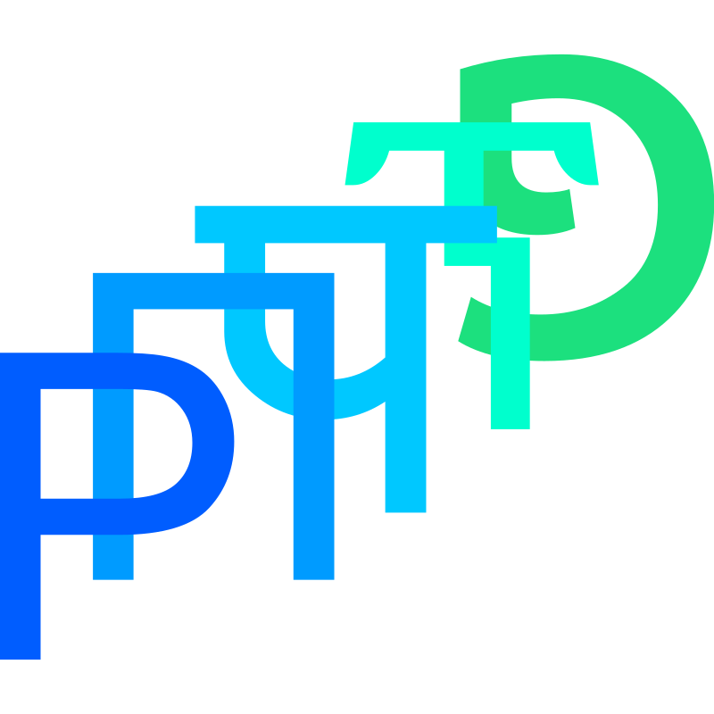

# Proto

Learn any language

## What is it?

Proto is a **universal, open-source toolset for learning new languages**.
It works perfectly well for any language, contains numerous tools for helping you study languages effectively, and is completely open-source and [hackable](./CONTRIBUTING.md).

## Why not Quizlet? Remnote?

Unlike Quizlet and Remnote, Proto is entirely open-source and designed specifically for language learning.
Proto is organized around **cards**, which store information about words you want to learn in a target language.
Cards can contain a term and definition, but that's not all!
You can add notes, tags, context, part of speech, and grammar information to each card.
Within each card, you can add **phrases**, which are common expressions related to the main term.
Proto will manage all of these properties for you and [test your knowledge on them effectively](./docs/philosophy.md#spaced-repetition) by identifying common missed terms.

### An example

Say you wanted to study the word "test" in Spanish.
You might begin by adding its definition "prueba."
But this isn't enough—how do you differentiate between *a test* (the noun) and *to test* (the verb)?
Proto allows you to add a part of speech identifier.
But now you need to add an article to the Spanish word—Proto allows you to specify a separate entry for this so you can learn that "prueba" takes the definite article "la."
Now you can add phrases, which are tested separately but still connected to the main card.
For example, you could create a phrase to specify that "put to test" means "puesto a prueba" in Spanish.
Each phrase can also have its own grammatical identifiers.
Not only that, but the way you configure these grammatical identifiers is entirely up to you—and entirely customizable for whatever language you choose to learn.
Rather than create one massive card with all this information or a series of related cards that are all tested separately, Proto allows you to combine contextual and grammatical information into your vocabulary studying—a feature that Quizlet and Remnote simply don't offer.
Can't wait to get started?
You can learn more about Proto's philosophy [here](./docs/philosophy.md).

## Setup

Start [here](./docs/README.md); the [docs](./docs/) folder contains all of the user-oriented documentation for the project.
[This section](./docs/setup.md) goes over installation and setup.

## Screenshots

## Contributing

We appreciate your contribution!
See our [contribution guide](./CONTRIBUTING.md) for more information; you may also want to glance at the internal [API docs](./api/docs/README.md) for more information about Proto's inner workings.
Please read our planned [todos](./TODOS.md) before submitting any feature requests or issues as they may already be documented.
