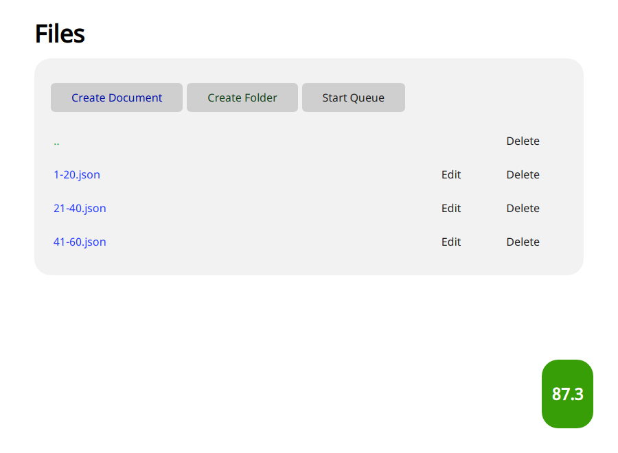
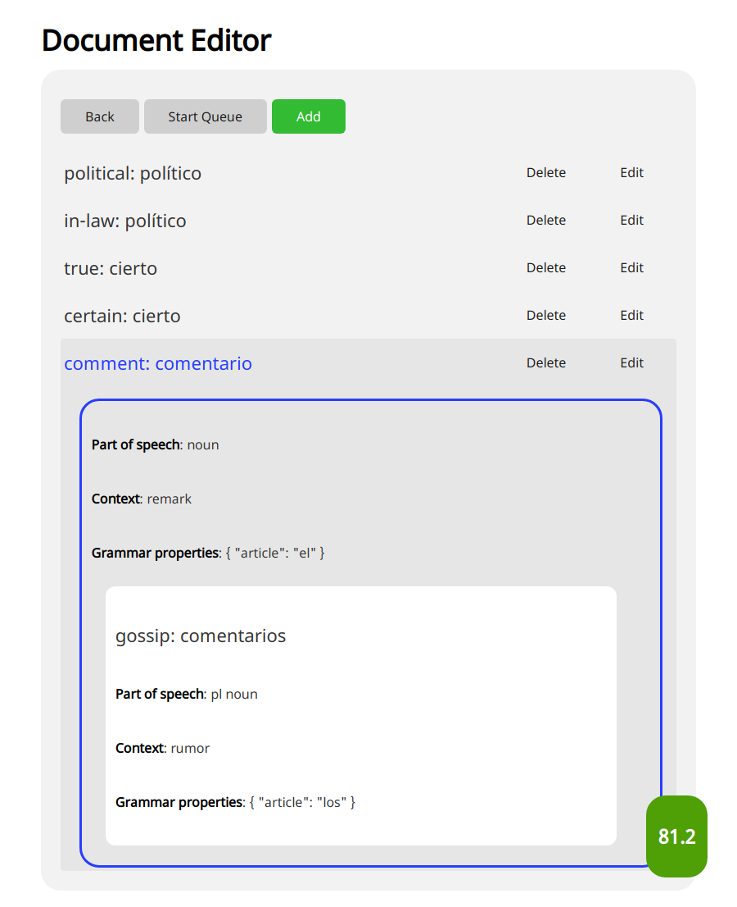
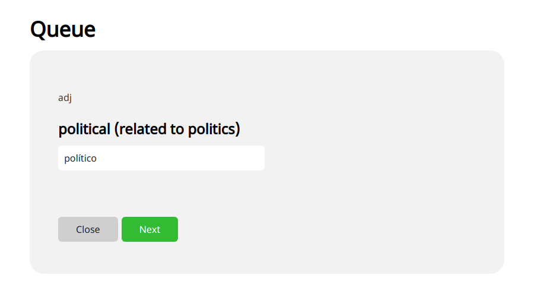

# Usage

This section focuses on how to use Proto, starting with the fundamentals and then moving on to more advanced topics.
We will assume you have finished [setting up](./setup.md) and [configuring](./philosophy.md) your installation.

---

## The Virtual File System

Proto's UI is centered around a **virtual file system** (VFS), which can be modified from the frontend UI and is automatically synced with your storage directory.
Any words you want to study are stored in **cards**, which contain a term and definition, among other things.
These **cards** are grouped together into **documents** (all of which have a `.json` extension).
At the top of the hierarchy are **folders**, which you can use within the top-level language directories to organize documents.

If your files are blank when you first load the frontend, try reloading the page.
Your frontend file system, once you've added a language or two, should look something like this:

First, a few keyboard shortcuts (these are only available on desktop).
Use <kbd>Ctrl</kbd>+<kbd>\\</kbd> to switch from light to dark theme and vice versa.
If you've set a PIN, <kbd>Ctrl</kbd>+<kbd>Q</kbd> will erase it from your device (typically these are saved as cookies so devices you've logged into will stay logged in).
You can also try <kbd>Alt</kbd>+<kbd>P</kbd> to get your current ping.

You can navigate the virtual file system by clicking on the folder you would like to navigate into.
This will open up a view of its subdirectories, which, if this is your first time using the file system, will likely be blank.
To go back, use the two dots in the top right corner of the file list.
Use the 'Create Document' and 'Create Folder' buttons **inside** one of the language directories to organize your file system.
Using these outside the language directories might cause errors since Proto will try to find a relevant grammar configuration.
Note that, as of right now, you cannot rename folders or files from the UI, which is not a recommended practice.
If you absolutely must, you'll need to do that from your local file system.
Additionally, you'll also need to adjust card metadata to match (see [this FAQ](../FAQ.md#resource-not-found-error-after-continuing-to-queue-review)).

After adding a few subdirectories, your file system might look something like this:

Don't worry about the number in the bottom right corner of the file list (this is probably zero if you don't have any cards); this is just a percentage of the total number of cards that Proto predicts you will remember.
The next thing to do is open a folder in the file system and create a document.
Clicking on the 'Create Document' button will open up a window where you can enter the name of the document (non-permitted characters will be replaced with a dash).
It should look something like this:

## Documents

When you open a folder with documents in it, the file system view will look like this:

Click on the 'Edit' button to add cards.
You can create new cards by clicking on the 'Add' button.
This will ask you for various pieces of information, of which only the term and definition are required to create a card.
However, filling out some of the additional fields like part of speech or context will be helpful as your knowledge base expands, so it's a good idea to make a habit of filling them out.
Tags and notes are only for categorization purposes; they won't be used or displayed during the queue, so feel free to use them for whatever you want if you need them (tags should be comma-separated).
The green box underneath the 'Context' field contains all your grammar properties with the relevant fields for entering them.
Again, none of them are actually required to create the card (some may even be automatically specified if you have enabled a default value and leave it blank in the UI).
You will also find a button to create a new phrase.
**Phrases** are subcards that nest inside a main card and store a related word or phrase and its definition.
They have all the same properties (including grammar) as a normal card but cannot contain phrases themselves.
The UI should look something like this:

Once you create a few cards, your document will contain a list of cards; clicking on a given card will bring up an overview of its properties:

## Queue

:tada: Great work so far!
You've successfully created your first document and first cards in Proto's file system.
Now let's cover how to begin the queue.
The **queue** is how Proto tests your knowledge of your cards and determines what you should study next.
You can start the queue from anywhere, and it will pull all testable cards from the location where you start it from.
Once you start it, you'll see something like this:

You'll notice Proto automatically pulls the term, part of speech, and context information and incorporates it into the card in the queue.
If you don't have any tested grammar properties for a specific card or if those grammar properties are prefix or suffix tested, you will have only one input box to enter the definition.
However, if you have inline grammar properties, you will see two buttons below the input box for creating additional inputs.
If you enabled hinting, inputs for hinted properties will automatically be created with the property label in the input box.
For remaining properties, you will need to create this input box by clicking the 'Add' button.
Each type of property is tested differently.
For boolean properties in particular, only create an input box if the property is true and enter only the name of the property in the input box.
For all other properties, put the name of the property and then, separated by a space, its value.
For grammar properties which allow multiple options, you'll need to specify each of the options followed by a space in the correct order to get the card right.
When you are done entering these properties and the definition, click the next button to move to the review phrase.
A screen similar to the following should pop up:

The two rectangles in the bottom right are the the two "scores" that Proto assigned to the card and the queue in general.
The first, leftmost score is Proto's guess at how strong your knowledge of the current card was prior to you just having studied it (from 0-100, starting at 0 if never studied or studied incorrectly last time).
The second score is the percentage of the queue that Proto estimates you will get correct based on your knowledge of the cards that it contains.

If you got anything wrong, look at the JSON to determine which property is `false`.
Once you've found your mistake or gotten the card right, click the 'Next' button to move to the next question.
Proto will continue until your queue is exhausted, but you can also track the progress bar at the top of the screen to see how far you are from the limit you set in your configuration options.

Proto is definitely a work-in-progress and it's no small task to learn!
The fact that you've gotten this far is an accomplishment in and of itself.
It will probably take some time for you to master the basics of using Proto effectively, but, with enough practice, you will master it.
If you have any feedback or questions, please let us know and good luck!
